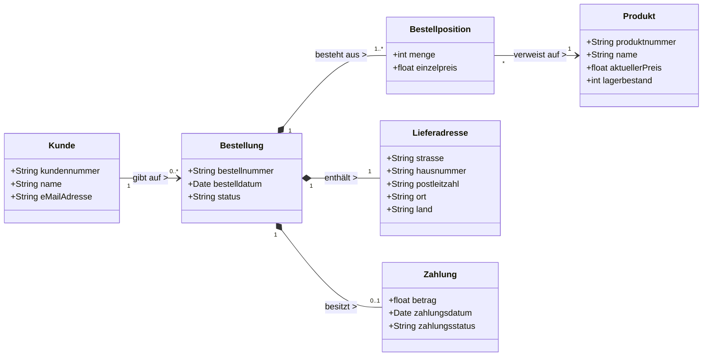

# UML-Klassendiagramm: Online-Shop

```mermaid
classDiagram
    direction LR

    class Kunde {
        +String kundennummer
        +String name
        +String eMailAdresse
    }

    class Bestellung {
        +String bestellnummer
        +Date bestelldatum
        +String status
    }

    class Bestellposition {
        +int menge
        +float einzelpreis
    }

    class Produkt {
        +String produktnummer
        +String name
        +float aktuellerPreis
        +int lagerbestand
    }

    class Lieferadresse {
        +String strasse
        +String hausnummer
        +String postleitzahl
        +String ort
        +String land
    }

    class Zahlung {
        +float betrag
        +Date zahlungsdatum
        +String zahlungsstatus
    }

    %% Beziehungen und Multiplizitäten
    Kunde "1" --> "0..*" Bestellung : gibt auf >
    Bestellung "1" *-- "1..*" Bestellposition : besteht aus >
    Bestellposition "*" --> "1" Produkt : verweist auf >
    Bestellung "1" *-- "1" Lieferadresse : enthält >
    Bestellung "1" *-- "0..1" Zahlung : besitzt >
```